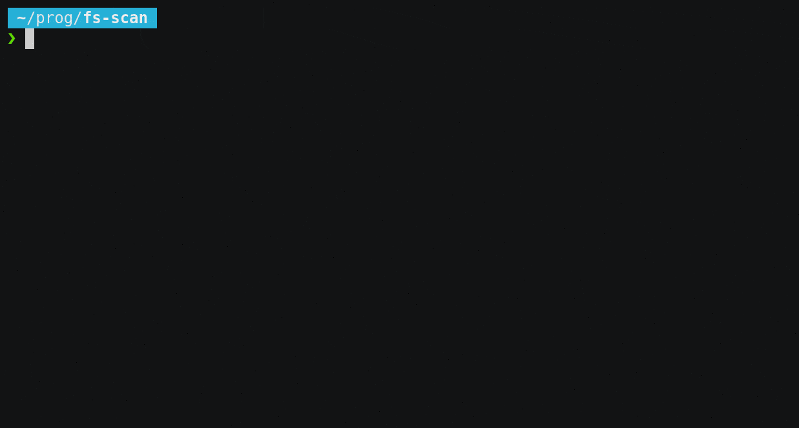

# fs-scan
Scan directory and sub directories to display file layout from the size standpoint.
The package use a root directory to start the recursive analyze.


_Example with Cargo which is Rust building tool and on a previous version where path was not mandatory._


# How to install the software

## Using compiled binaries (Linux and Windows)

Download the appropriate binary from the [latest release page](https://github.com/DDNeu/fs-scan/releases/latest).
Make the downloaded file executable and run it as any other binary or script from command line.

## From sources (Cargo building environnement is needed)

You can build the tool yourself.
You will need a recent Cargo tool set. We recommend to use the latest version easy to install with a single command. All explained at https://www.rust-lang.org/learn/get-started.

# How to use the software

The software require at least a \<PATH\> to execute. The minimal command would look like this:
```
# fs-scan /lustre
```
And the output would look something like:
```
Scan took 39 minutes
Files -> 109M (109754681)
Directories -> 239K (239747)
Empty files -> 15K (15281)
Less than 4K -> 9M (9630337)
Between 4KB and 8KB -> 6M (6277154)
Between 8KB and 16KB -> 12M (12446367)
Between 16KB and 32KB -> 24M (24679127)
Between 32KB and 64KB -> 48M (48469887)
Between 64KB and 128KB -> 3M (3806961)
Between 128KB and 256KB -> 2M (2167802)
Between 256KB and 512KB -> 933K (933982)
Between 512KB and 1MB -> 921K (921796)
Between 1MB and 10MB -> 334K (334297)
Between 10MB and 100MB -> 12K (12699)
Between 100MB and 1GB -> 56K (56673)
More than 1GB -> 2K (2318)
```
Other parameters are also available. You can easily check them with:
```
# fs-scan -h
Scan recursively the given directory and generate a report of the scanned files based on their relative size

Usage: fs-scan [OPTIONS] <PATH>

Arguments:
  <PATH>  

Options:
  -t, --max-threads <MAX_THREADS>  Maximum number of parallel threads. If not configured, 4 times the number of detected logical CPU [default: 0]
  -s, --save-csv                   If specified a CSV log file is generated. Multiple run can be done from the same directory to collect outputs from multiple directories in a single file
  -h, --help                       Print help information
  -V, --version                    Print version information
```